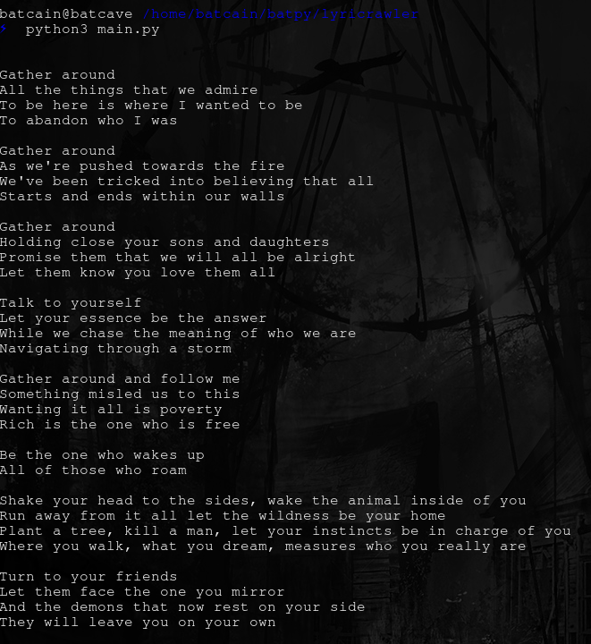
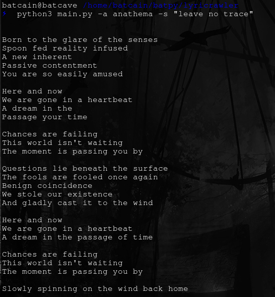

# Lyricrawler
A script that can fetch lyrics of music you are currently listening on spotify. WIP.

### Installation
``` 
pip3 install requirements.txt 
```

### Usage
-> If you want lyrics of what you are currently listening:
``` 
python3 main.py
```



-> If you want to enter the song manually:
```
python3 -a "artist name" -s "song name"
```
 
